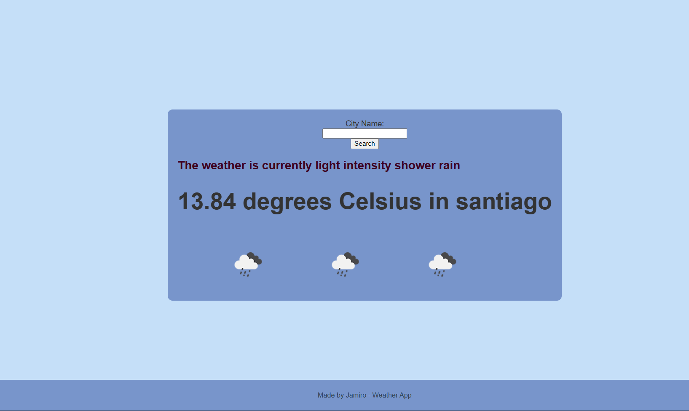

# Weather App 

La Weather App es una aplicación web que te permite obtener información sobre el clima de una ciudad específica. Puedes ingresar el nombre de la ciudad en el formulario de búsqueda y la aplicación te mostrará la temperatura actual y una descripción del clima en esa ciudad, junto con un ícono que representa las condiciones climáticas.

## Tecnologías utilizadas

La aplicación se ha desarrollado utilizando las siguientes tecnologías y herramientas:

- HTML
- CSS
- JavaScript
- Node.js
- Express.js
- EJS (Embedded JavaScript templates)
- OpenWeatherMap API

## Instalación

1. Clona el repositorio de la Weather App en tu máquina local utilizando el siguiente comando:
git clone <url_del_repositorio>

2. Ve a la carpeta del proyecto:
cd weather-app

3. Instala las dependencias del proyecto utilizando npm:
npm install

4. Inicia la aplicación:
npm start o node app.js

La aplicación ahora debería estar en funcionamiento y accesible en tu navegador en `http://localhost:3000`.

## Uso

Una vez que la aplicación esté en funcionamiento, puedes abrir tu navegador e ingresar la URL `http://localhost:3000` para acceder a la página principal de la Weather App. En esta página, encontrarás un formulario de búsqueda donde puedes ingresar el nombre de la ciudad cuyo clima deseas consultar. Haz clic en el botón "Search" para obtener la información del clima.

La aplicación te mostrará la temperatura actual y una descripción del clima en la ciudad ingresada, así como un ícono que representa las condiciones climáticas.

Si ingresas un nombre de ciudad o país que no pueda ser encontrado por la API de OpenWeatherMap, la aplicación mostrará un mensaje de error personalizado.

## Contribuciones

Si deseas contribuir a este proyecto, ¡serás bienvenido! Puedes enviar tus sugerencias, correcciones o nuevas características a través de Pull Requests. Asegúrate de seguir las pautas de contribución del proyecto.

## Licencia

Este proyecto está bajo la Licencia MIT. Puedes consultar el archivo [LICENSE](LICENSE) para obtener más detalles.
